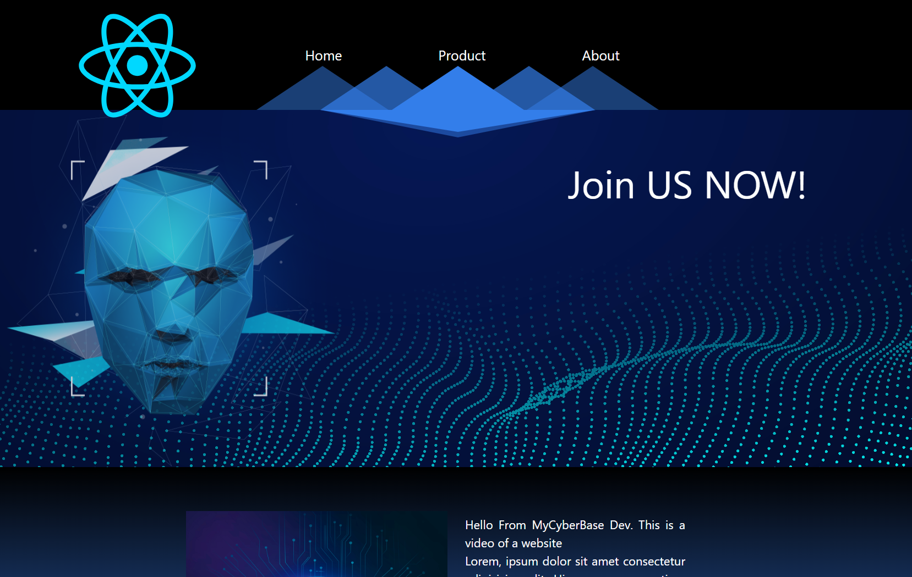
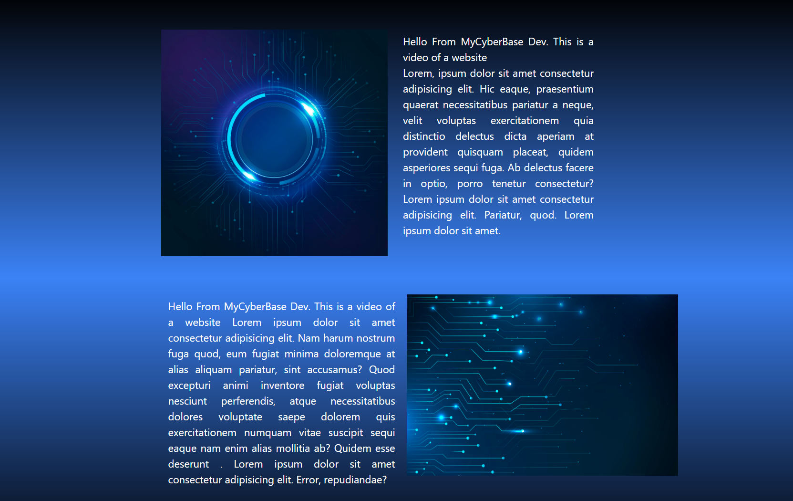

# Modern Website Design Template

## Overview

This repository provides a sophisticated template for modern website design. It seamlessly integrates React into the Vite development environment, featuring Hot Module Replacement (HMR) and carefully curated ESLint rules to elevate code quality.

## Screenshots

## Features

- **React Integration:** Effortlessly incorporates React into the Vite development workflow.
- **Hot Module Replacement (HMR):** Enhances the development experience with fast refresh capabilities. Choose between [Babel](https://babeljs.io/) via [@vitejs/plugin-react](https://github.com/vitejs/vite-plugin-react/blob/main/packages/plugin-react/README.md) or [SWC](https://swc.rs/) via [@vitejs/plugin-react-swc](https://github.com/vitejs/vite-plugin-react-swc).

## Usage

Follow these steps to get started:

1. Clone the repository: `git clone https://github.com/hridoythebest/modernWebsite`
2. Install dependencies: `npm install`
3. Run the development server: `npm run dev`

## Official Plugins

This template currently supports two official plugins:

- **[@vitejs/plugin-react](https://github.com/vitejs/vite-plugin-react/blob/main/packages/plugin-react/README.md):** Utilizes Babel for Fast Refresh.
- **[@vitejs/plugin-react-swc](https://github.com/vitejs/vite-plugin-react-swc):** Uses SWC for Fast Refresh.

Refer to the respective documentation for detailed information on each plugin.

## Contribution

We welcome contributions to enhance and refine this modern website design template. Please feel free to submit issues or pull requests.

## License

This project is licensed under the [MIT License](LICENSE).
